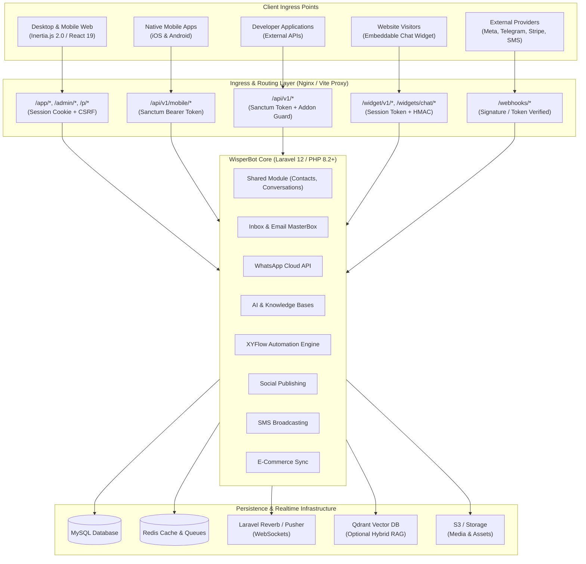
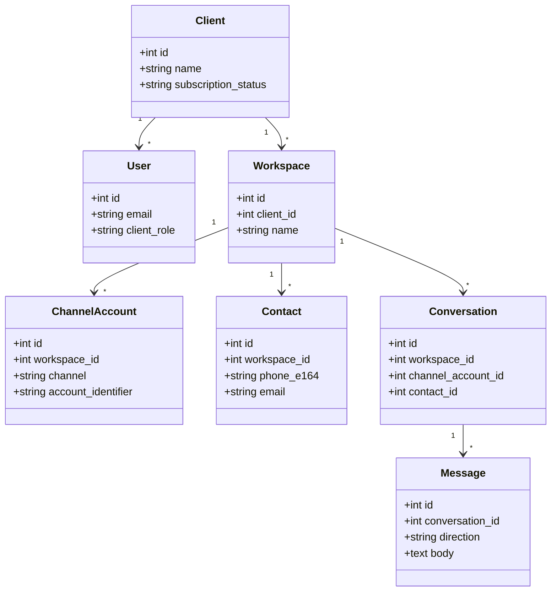
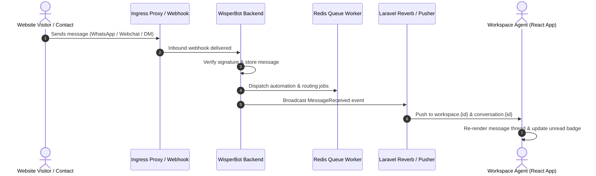

# WisperBot — Technical Architecture Specification

This document defines the mandatory structural patterns, layer boundaries, multi-tenancy models, event pipelines, and quality standards for **WisperBot**. All backend and frontend implementations must strictly adhere to these specifications.

---

## 1. System Boundary & Network Ingress



### Architectural Invariants
1. **Strict Dual Authentication Boundaries**: 
   - Browser web sessions use Laravel session cookies with CSRF token verification.
   - Mobile apps and external developer APIs use Laravel Sanctum Bearer tokens.
2. **Encrypted Credentials**: External API keys, OAuth refresh tokens, and provider secrets are encrypted in the database (`Crypt::encryptString`) and never returned unmasked to the browser.
3. **Public Widget Isolation**: Visitor conversations from `/widget/v1/*` are pinned to a unique session token. Unsigned identities remain anonymous; signed identities require server-side HMAC validation (`hash_hmac`).
4. **Idempotent Webhook Processing**: Inbound webhooks (`/webhooks/*`) undergo cryptographic signature verification and payload deduplication before dispatching jobs onto background queues.

---

## 2. Directory Structure & Module Hierarchy

WisperBot implements a **Modular Monolith** architecture where distinct business domains are isolated within `app/Modules/`, combined with an Inertia/React frontend.

```text
wisperbot/
├── app/
│   ├── Console/Commands/        # System maintenance, license checks, cron tasks
│   ├── Http/
│   │   ├── Controllers/         # Platform, admin, and client root controllers
│   │   ├── Middleware/          # Tenancy, Addon verification, 2FA, Sanctum
│   │   └── Requests/            # Form validation requests
│   ├── Models/                  # Core tenancy models (User, Client, Workspace, Plan)
│   ├── Modules/                 # Domain Vertical Slices (Self-contained)
│   │   ├── AI/                  # Smart bots, knowledge bases, vector search, providers
│   │   ├── Automation/          # Visual workflow engine, triggers, actions, runs
│   │   ├── Broadcasting/        # SMS gateways, campaigns, delivery tracking
│   │   ├── Ecommerce/           # Shopify, WooCommerce, BigCommerce store sync
│   │   ├── Inbox/               # Omni-channel inbox, email masterbox, chat widgets
│   │   ├── Integrations/        # Shared OAuth foundations & encrypted settings
│   │   ├── Leads/               # Core lead data layer
│   │   ├── Shared/              # Contacts, conversations, messages, channel accounts
│   │   ├── Social/              # Social media OAuth, post composer, scheduler
│   │   └── Whatsapp/            # WABA management, cloud templates, auto-replies
│   ├── Providers/               # Service providers (Module discovery, Broadcast channels)
│   └── Services/                # Cross-cutting services (Stripe, Licensing, Storage)
├── resources/
│   ├── js/
│   │   ├── Components/          # Shared React UI & domain composites
│   │   │   ├── ui/              # Design system primitives (Button, Modal, Drawer, Badge)
│   │   │   ├── Inbox/           # Conversation cards, chat thread, message bubbles
│   │   │   └── Charts/          # Analytics & telemetry visualizations
│   │   ├── Layouts/             # ClientLayout, InboxLayout, AdminLayout, AuthLayout
│   │   ├── Pages/               # Inertia page components organized by feature
│   │   ├── hooks/               # Custom hooks (useOneSignal, useEcho, useDebounce)
│   │   ├── locales/             # i18n translation bundles
│   │   └── app.jsx              # Frontend application entry point
│   └── views/                   # Root Blade template (app.blade.php)
├── routes/
│   ├── admin.php                # Super Admin routes
│   ├── api.php                  # Mobile & developer REST API routes
│   ├── auth.php                 # Authentication & password recovery routes
│   ├── channels.php             # Private WebSocket channel definitions
│   ├── client.php               # Client account, workspace, settings & billing routes
│   ├── web.php                  # Marketing landing, CMS, and health probes
│   └── webhooks.php             # Provider callback endpoints
└── tests/
    ├── Feature/                 # Integration tests for HTTP endpoints & workflows
    └── Unit/                    # Pure unit tests for domain logic & helpers
```

---

## 3. Multi-Tenancy & Workspace Data Scoping

WisperBot enforces strict **Logical Workspace Isolation** across all persistence, background processing, and real-time messaging layers:



### Tenancy Enforcement Invariants
1. **Mandatory Query Scoping**: Every database lookup must scope by the active `workspace_id`.
2. **Channel Asset Exclusivity**: A provider account (e.g. WhatsApp Phone Number ID, Facebook Page ID, Instagram Account ID) is bound exclusively to a single `workspace_id` to prevent cross-tenant message contamination.
3. **Queue Job Hydration**: Queue jobs pass database IDs (not full serialized models) and re-verify tenant ownership at execution time.
4. **WebSocket Authorization**: Channel authorization rules in `BroadcastChannelsServiceProvider` authenticate the active user's workspace membership before granting access to `workspace.{id}` or `conversation.{id}` channels.

---

## 4. Asynchronous Queues & Background Processing

Background jobs are categorized into dedicated queues to prevent high-volume operations (e.g. bulk SMS broadcasting) from blocking time-sensitive operations (e.g. inbound chat routing):

| Queue Name | Purpose | Worker Priority | Examples |
| :--- | :--- | :--- | :--- |
| `default` | General tenant operations, email sync, notifications | Normal (3) | `SyncEmailAccountJob`, `SendNotificationJob`, `DataExportJob` |
| `whatsapp` | Inbound & outbound WhatsApp, Meta Messenger, Instagram | High (1) | `ProcessInboundWhatsAppMessageJob`, `ProcessMetaWebhookJob` |
| `ai` | Document chunking, vector embedding, smart bot execution | Normal (2) | `IndexKnowledgeDocumentJob`, `GenerateAiResponseJob` |
| `social` | Scheduled social media post publishing | Normal (3) | `PublishSocialPostJob`, `RefreshSocialTokensJob` |
| `broadcast` | Bulk SMS campaign batching & dispatching | Low (4) | `DispatchSmsBatchJob`, `ProcessSmsDeliveryCallbackJob` |
| `automation` | XYFlow visual workflow step evaluation & execution | High (1) | `ExecuteAutomationStepJob`, `ResumeDelayedAutomationJob` |
| `ecommerce` | Store catalog, order, and customer syncing | Low (4) | `SyncStoreOrdersJob`, `ProcessShopifyWebhookJob` |

---

## 5. Integrations & External Service Contracts

WisperBot integrates with multiple third-party providers with resilient fallback mechanisms:

| Integration | Protocol / Transport | Purpose | Architectural Rules |
| :--- | :--- | :--- | :--- |
| **WhatsApp Cloud API** | Graph API / Webhooks | WABA messaging, template syncing | Webhooks verified via `hub.verify_token`. Inbound payloads processed on `whatsapp` queue. |
| **Meta (FB & IG)** | Graph API / OAuth 2.0 | Page inbox, Instagram DM, Post publishing | Granular `target_ids` used for asset binding. Post deletion respects provider capability. |
| **Telegram Business** | Bot API / Webhooks | Inbound updates & agent replies | Webhook secret token verified on arrival. |
| **Email (Gmail/M365/IMAP)** | OAuth 2.0 / IMAP & SMTP | Master Email Inbox synchronization | Sync worker runs every minute; multi-mailbox support per workspace. |
| **AI Providers** | REST / SSE Streaming | Knowledge retrieval, smart bot generation | Client BYOK supports OpenAI, Anthropic, and Gemini; DeepSeek and Qwen 3.7 Flash are Super Admin system-only. One tested system provider powers managed generation. MySQL fallback for vectors; optional Qdrant. |

Knowledge video resources are stored as validated metadata on `ai_kb_documents`, while their descriptions/transcripts are chunked through the normal `ai` indexing queue. `ChatbotRunner` returns `{reply, tokens_used, resources}`; outbound messages remain type `text` and carry an additive `payload.resources` array so provider and older-client compatibility is preserved.

Managed AI usage is enforced at `LlmGateway`, not in individual controllers. The active plan's explicit `limits.ai_credits_per_month` value is the sole entitlement source; price never determines credits. `ai_credit_periods` pools that finite monthly allowance by Client organization or standalone workspace owner, while `ai_credit_ledgers` records immutable reservations, completions, refunds, BYOK calls, action/rate versions, token counts, micro-USD cost estimates, and audited adjustments. Fixed action rates and client labels share `config/ai_credits.php` as one catalog. `ai_workspace_settings.provider_mode` selects `managed`, `byok`, or `auto_fallback`. A unique account-scoped idempotency hash prevents browser, queue, and webhook retries from charging twice. Provider tests and embeddings bypass credit charging; customer OpenAI/Gemini embeddings take precedence before the managed embedding provider.
| **SMS Gateways** | REST / HTTP Callbacks | Bulk SMS campaigns | Pluggable gateway adapters (Twilio, MessageBird, SMSBD, REVE, BulkSMS, ProSMS, SNS). |
| **Payment Gateways** | Webhooks / SDKs | Subscriptions, add-ons, invoices | Stripe, PayPal, and Paddle supported with signature validation. |

---

## 6. Real-Time Event & Broadcasting Architecture

Real-time browser and mobile synchronization is powered by **Laravel Reverb** (default) or **Pusher Protocol** paired with **Laravel Echo**:



### Channel Authorization Schemes
- **`workspace.{workspaceId}`**: Accessible by active workspace members. Carries unread count updates, new conversation alerts, and presence status.
- **`conversation.{conversationId}`**: Accessible only if the user belongs to the owning workspace. Carries live message bubbles and typing indicators.
- **`widget.session.{sessionToken}`**: Public visitor channel scoped by secure session token for website chat.

---

## 7. Health Monitoring & Observability

WisperBot includes health and readiness endpoints protected by `HEALTHZ_TOKEN`:

- `GET /healthz/db`: Validates active database connection and query readiness.
- `GET /healthz/redis`: Validates Redis ping and cache latency.
- `GET /healthz/queue`: Validates queue worker backlog and queue driver status.

---

## 8. Quality Gates & Testing Strategy

```text
                     ┌───────────────────────────┐
                     │   End-to-End Workflows    │
                     │  (Browser & API Testing)  │
                     └─────────────┬─────────────┘
                                   │
                     ┌─────────────┴─────────────┐
                     │   Integration / Feature   │
                     │  (HTTP, Webhooks, Queues) │
                     └─────────────┬─────────────┘
                                   │
                     ┌─────────────┴─────────────┐
                     │     Unit & Component      │
                     │ (PHPUnit, Vitest, Libs)   │
                     └───────────────────────────┘
```

### Verification Commands
- **Backend Linting**: `./vendor/bin/pint --test`
- **Backend Static Analysis**: `./vendor/bin/phpstan analyse --memory-limit=512M`
- **Backend Automated Tests**: `php artisan test --parallel`
- **Frontend Automated Tests**: `npm test`
- **Frontend Linting & Formatting**: `npm run lint && npm run format`
- **Production Asset Build**: `npm run build`

---

## 9. Change Management Checklists

## Guarded Knowledge Base lifecycle

`ai_knowledge_bases` points to one live `published_revision_id` and optionally one editable `draft_revision_id`. `ai_kb_revisions` are immutable snapshots linked through `ai_kb_revision_documents`; a failed draft never replaces the live revision. Adding or removing a source changes only the draft membership. Reindexing, editing, or toggling a source inherited from a published revision uses copy-on-write: the draft receives a new document identity while the published document and its chunks remain untouched. `IndexDocumentJob` runs extraction → deterministic validation → section-aware chunking → changed-chunk embedding on the existing `ai` queue. Runtime retrieval passes the published revision ID to `EmbeddingStore` and additionally requires workspace ownership, enabled/approved/indexed documents, and ready embeddings.

Answer and query-embedding caches are revision/model keyed. Publishing or rollback invalidates answer caches. Retrieval diagnostics store IDs, scores, decisions, and token categories but not customer text; repeated unsupported questions are recorded as bounded knowledge-gap samples.

### Adding a New Integration Channel
- [ ] Implement channel driver under `app/Modules/<Module>/Services/`.
- [ ] Add webhook endpoint in `routes/webhooks.php` with signature verification.
- [ ] Map provider asset IDs to `channel_accounts` table scoped by `workspace_id`.
- [ ] Add channel brand icon in `resources/js/Components/BrandIcons.jsx`.
- [ ] Add unit and feature tests covering message ingestion and token refresh.

### Adding an Automation Node Type
- [ ] Define node type and category in `resources/js/Pages/Automation/Builder.jsx`.
- [ ] Implement backend execution logic in `app/Modules/Automation/Services/AutomationRunner.php`.
- [ ] Add translation keys for node label and description in `resources/js/locales/`.
- [ ] Verify node serialization and execution flow with a feature test.
