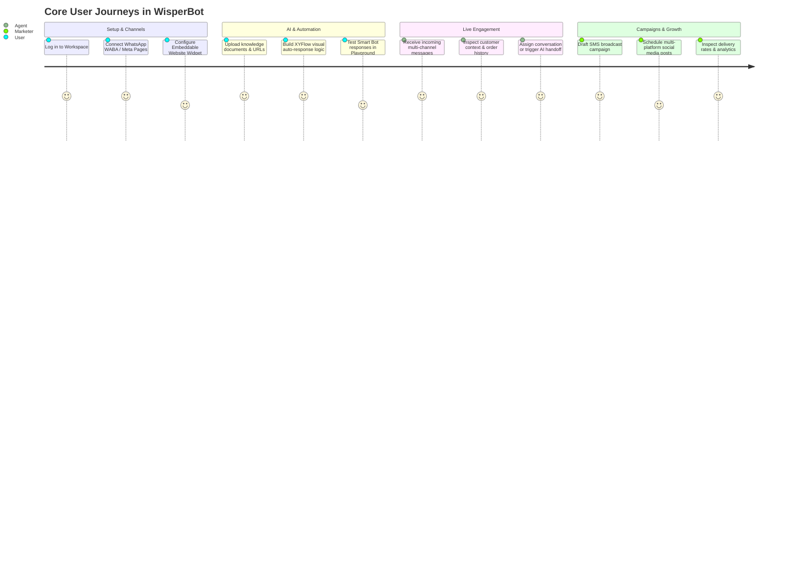

# WisperBot — Implementation Plan & Feature Specifications

## 1. Purpose & Product Vision

**WisperBot** is an enterprise-grade, omni-channel customer messaging, AI automation, and engagement SaaS platform. It centralizes customer conversations across WhatsApp, Meta Messenger, Instagram DMs, Website Chat, Telegram, and Email into a single unified agent workspace, augmented with autonomous AI knowledge bots, visual workflow automations, and targeted SMS broadcasting.

---

## 2. Core User Journeys



---

## 3. Feature Modules & Detailed Specifications

### Feature 1: Multi-Tenancy, Auth & Team Management (`app/Http/Controllers/Client/*`)

#### Capabilities
- **Authentication & Security**: Email/password authentication, Magic Link login, Google/Socialite OAuth, and Google Authenticator 2FA (`TwoFactorController`).
- **Workspace Switching**: Seamless switching between client-owned workspaces (`WorkspaceController`) with strict scoped sessions.
- **Role-Based Team Access**: Client administrators can invite team members, assign granular roles (Admin, Agent, Viewer), and inspect audit logs (`TeamController`, `ClientAuditLogController`).
- **Session Management**: View and revoke active browser sessions remotely (`SessionController`).

#### Verification Criteria
- [x] Unauthenticated requests redirect to `/login`.
- [x] Workspace switching immediately re-scopes all active queries, broadcast channels, and settings.
- [x] Deactivating a team member terminates their active sessions immediately.

---

### Feature 2: Omni-Channel Agent Inbox & Master Email Inbox (`app/Modules/Inbox`, `app/Modules/Shared`)

#### Capabilities
- **Unified Conversation Stream (`/app/inbox`)**: Real-time conversation list filtered by folders (`All`, `Mine`, `Unassigned`, `Resolved`, `Snoozed`) and channels (WhatsApp, Instagram, Messenger, Webchat).
- **Interactive Chat Interface**:
  - Rich message formatting with image, video, audio, and document attachment previews.
  - Canned replies (`/quick-reply`) for fast repetitive response delivery.
  - Internal agent private notes and conversation tagging.
  - Real-time agent typing indicators and live presence detection.
- **Master Email Inbox (`/app/inbox/email`)**: Dedicated multi-mailbox email client synchronizing Gmail, Microsoft 365, and IMAP/SMTP accounts with folder organization and threaded conversations.

#### UI State Machine
```text
[Incoming Message] ──► [Unassigned Folder] ──(Assign Agent)──► [Mine Folder]
                              │                                      │
                              ├────────(Trigger AI Handback)─────────┤
                              ▼                                      ▼
                      [AI Handling Turn] ◄────(2 Fails/Turn)───► [Human Agent]
                              │                                      │
                              └───────(Mark Resolved)────────────────► [Resolved]
```

---

### Feature 3: Embeddable Website Chatbot Widget (`/widget/v1/*`, `public/widgets/chat/*`)

#### Capabilities
- **Lightweight Script Loader**: Embed script (`/widgets/chat/{widgetKey}.js`) dynamically injects the WisperBot Chat Launcher onto client websites.
- **Visitor Session Isolation**: Each visitor is assigned a secure cryptographic session token. Unauthenticated visitors stay anonymous; authenticated user profiles are verified via server-side HMAC validation.
- **AI-to-Human Handoff**: Auto-engages visitors with knowledge base answers, offering a smooth handoff to live agents after 2 failed turns or explicit user request.
- **Custom Branding**: Configurable colors, greeting messages, avatar launcher icon, and pre-chat capture forms.

---

### Feature 4: WhatsApp Cloud API & Template Manager (`app/Modules/Whatsapp`)

#### Capabilities
- **Meta Embedded Signup**: Direct WABA account onboarding and phone number registration via Meta Embedded Signup flow.
- **Template Lifecycle Management**: Create, submit for Meta approval, and synchronize WhatsApp Message Templates (Header, Body, Buttons, Parameters).
- **Keyword Auto-Replies**: Rule-based automated responses triggered by inbound keyword patterns.
- **Media Messaging**: Inbound and outbound support for interactive buttons, list messages, documents, location pins, and voice notes.

---

### Feature 5: Social Media Publisher & Scheduler (`app/Modules/Social`)

#### Capabilities
- **Social Media Automation (`/app/social/automation`)**: A unified workspace for compact OAuth account management, upcoming/draft/published/failed post lists, search and filters, and an integrated calendar view.
- **Multi-Platform Scheduling (`/app/social/automation/schedule`)**: Compose copy, attach media, preview platform-specific layouts, and explicitly choose scheduled delivery or immediate publication.
- **Connected Accounts**: Connect multiple Facebook Pages, Instagram Business Accounts, LinkedIn profiles, YouTube channels, and TikTok accounts from the unified workflow.
- **Capability-Driven Deletion**: Safely distinguishes remote platform deletion capabilities between Facebook (supported) and Instagram (API limited).

---

### Feature 6: AI Knowledge Bases & Autonomous Smart Bots (`app/Modules/AI`)

#### Capabilities
- **Multi-Source Knowledge Ingestion**: The guided client UI accepts focused website URLs, files, and XML sitemaps. Existing raw-text, FAQ, and dedicated-video records remain compatible but are not separate authoring choices. `IndexDocumentJob` discovers validated YouTube, Vimeo, and public HTTPS MP4 links inside extracted pages/files, while the surrounding guidance drives semantic retrieval; a chatbot-level score threshold allows at most one video from the query-matched passage per answer.
- **Zero-configuration website discovery**: The Website source accepts a homepage or sitemap URL, follows validated HTTPS redirects, checks HTML sitemap declarations, `robots.txt`, and common sitemap paths, then falls back to a capped same-host link crawl. Nested indexes and duplicate URLs are bounded by the Knowledge Base sitemap page limit.
- **Video Knowledge Answers**: AI responses retain normal text while adding a structured `payload.resources[]` video card. WisperBot web/mobile clients render click-to-play players; external messaging providers receive the canonical video link because they cannot render embedded players.
- **Hybrid Vector Retrieval**: Built-in MySQL vector-like similarity fallback with high-performance Qdrant vector database support.
- **LLM Provider Agnostic**: Client BYOK supports OpenAI, Anthropic, and Google Gemini. DeepSeek and Alibaba Qwen 3.7 Flash are restricted to Super Admin system integrations and are never exposed as workspace providers. A tested, enabled system LLM can be selected to power managed generation; Knowledge Base embeddings continue through OpenAI or Gemini.
- **Smart Bot Configuration**: Define persona prompt instructions, confidence thresholds, temperature, and fallback behaviors.
- **Managed AI Credits**: Every production generation path uses `LlmGateway`, which applies a centrally versioned action weight, atomically reserves organization-pooled monthly credits, finalizes only a usable response, and refunds failures. Workspaces choose managed, BYOK, or validated automatic fallback. Embeddings and provider tests cost zero credits.
- **Guarded Knowledge Publishing**: Behind `KB_GUARDED_PUBLISHING`, client content follows Define → Add sources → Review quality → Test answers → Publish. Immutable revisions keep the last healthy version live while edits are extracted, deterministically checked, embedded, and regression-tested. Blocked, degraded, disabled, rejected, or unpublished sources cannot reach live retrieval.
- **Retrieval Cost Controls**: Exact approved FAQs bypass generation, safe answers cache for 24 hours per chatbot/revision, query embeddings cache for seven days, unchanged chunk hashes reuse embeddings, and normal answers use no more than three passages/1,200 context tokens by default. Low-confidence business questions clarify or hand off rather than using general knowledge.

---

### Feature 7: Visual Workflow Automation Builder (`app/Modules/Automation`)

#### Capabilities
- **Drag-and-Drop Node Canvas**: Interactive node-graph builder powered by **XYFlow / React Flow** (`/app/automations/builder/{id}`).
- **Comprehensive Node Catalog**:
  - **Triggers**: `contact.created`, `message.received`, `tag.added`, `order.placed`, `cart.abandoned`, `webhook.received`.
  - **Send**: Send WhatsApp message, send template, send email, push notification.
  - **Logic**: Condition branch (If/Else), Time delay (Wait X hours/days), Random A/B split.
  - **Contact**: Add tag, remove tag, update custom field, assign agent.
  - **Integrations**: Fire external webhook, execute AI prompt, sync CRM lead.
- **Execution Engine**: Asynchronous step execution via `ExecuteAutomationStepJob` with run logs and telemetry.

---

### Feature 8: SMS Broadcasting & Gateway Connector (`app/Modules/Broadcasting`)

#### Capabilities
- **Pluggable SMS Gateways**: Pre-integrated drivers for Twilio, MessageBird, SMSBD, REVE SMS, BulkSMS BD, ProSMS (Alaris), and Amazon SNS.
- **Segmented Campaigns**: Dispatch targeted SMS broadcasts to dynamic contact segments or CSV uploads.
- **Rate Limiting & Queue Batching**: Throttled chunk dispatching on the `broadcast` queue to comply with carrier rate limits.
- **Delivery Callbacks**: Real-time SMS status tracking (Queued, Sent, Delivered, Failed) with cost metering.

---

### Feature 9: E-Commerce Store Integration (`app/Modules/Ecommerce`)

#### Capabilities
- **Store Connectors**: OAuth connectors for Shopify, WooCommerce, and BigCommerce stores.
- **Contextual In-Chat Customer Widget**: When an agent chats with a customer, their active cart, recent order numbers, fulfillment status, and total lifetime spend display in the side panel.
- **Automated Abandoned Cart Recovery**: Ingests store events to trigger automated recovery messages via WhatsApp.

---

### Feature 10: Subscriptions, Add-ons & Developer Platform (`app/Http/Controllers/Client/*`)

#### Capabilities
- **Tiered Plans & Usage Metering**: Automated enforcement of contact limits, monthly message quotas, finite monthly WisperBot AI credits, and team member capacity. Credits reset on the subscription anniversary month even for annual billing, never roll over, and do not create automatic overage charges.
- **AI Credit Safety**: Account administrators receive once-per-period in-app and email warnings at 80% and 100%. Credit-blocked automation runs pause at their current AI node and expose an explicit retry after the billing or provider issue is resolved.
- **Self-Service Checkout**: Automated billing and invoicing via Stripe, PayPal, and Paddle.
- **Developer Tools Add-on**:
  - API Token generator with scoped permissions for REST APIs (`/api/v1/*`).
  - Outbound Webhook Endpoints with secret rotation and delivery logs (`/app/webhooks`).
  - Interactive OpenAPI/Swagger documentation (`/app/api-docs`).

---

## 4. Testing & Verification Matrix

| Module / Area | Test Type | File Reference | Coverage Target |
| :--- | :--- | :--- | :--- |
| **Workspace Scoping** | Feature | `tests/Feature/WorkspaceScopingTest.php` | 100% tenant isolation across models. |
| **WhatsApp Ingestion** | Feature | `tests/Feature/WhatsAppWebhookTest.php` | Signature validation, message storage & Echo broadcast. |
| **Widget HMAC Auth** | Feature | `tests/Feature/WidgetSessionTest.php` | Anonymous vs HMAC signed visitor flows. |
| **Automation Runner** | Unit / Feature | `tests/Feature/AutomationExecutionTest.php` | Branch evaluation, delays & step transitions. |
| **Navigation & Layout** | Component | `resources/js/__tests__/useClientNav.test.jsx` | Sidebar permission filtering & route active states. |
| **Contact Operations** | Unit | `resources/js/__tests__/contactListOperations.test.js` | Filtering, segment selection & bulk mutations. |
| **Stripe / Billing** | Feature | `tests/Feature/BillingWebhookTest.php` | Subscription renewals, plan changes & cancellations. |
